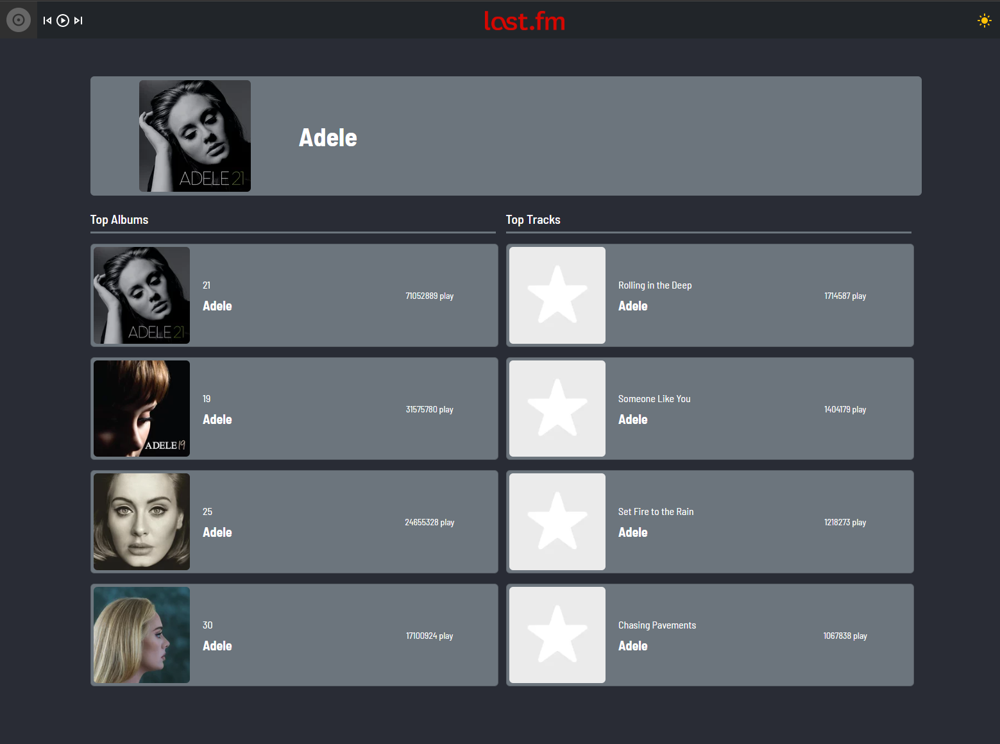

#  Last.fm Music List

A basic music list web application which is created with using ReactJS. It fetches the data from Last.fm API with Axios.
You can view the top artist lists at home page and check the details of an artist which you select. You can also view the application in dark or light mode.

##  Last.fm Music List

You can view the site here
[Click Me](https://fazlagida-task-lastfm.vercel.app/)

You can view the Storybook here
[Click Me](https://637b60f6ee391f9474ea1f3d-ghgrhlyeri.chromatic.com/?path=/story/header--normal)

## Topics

- ReactJS
- React Hooks
- React Router
- React-Testing-Library
- Axios
- Last.fm APIs
- Bootstrap
- CSS
- MUI Icons
- Deployed with Vercel

## Author

Ozan Gürsucu (ozngrsc)

## Available Scripts

In the project directory, you can run:

### `npm start`

Runs the app in the development mode.\
Open [http://localhost:3000](http://localhost:3000) to view it in the browser.

The page will reload if you make edits.\
You will also see any lint errors in the console.

### `npm test`

Launches the test runner in the interactive watch mode.\
See the section about [running tests](https://facebook.github.io/create-react-app/docs/running-tests) for more information.
